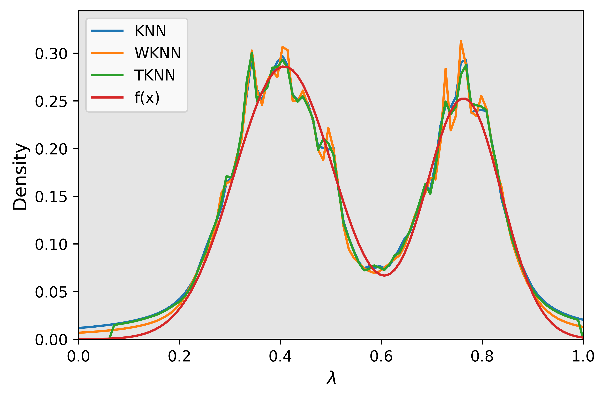
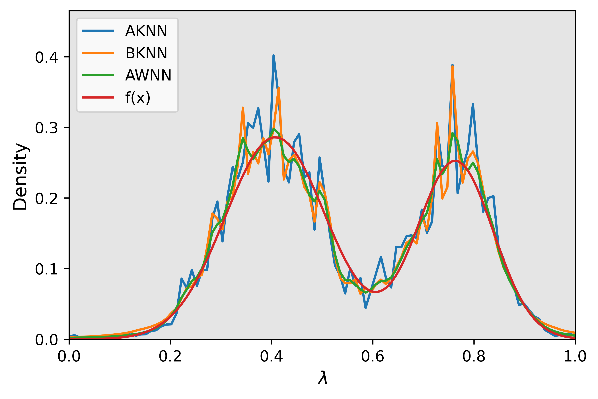

# Summary

    Nearest Neighbor based Density Estimation is a class of density estimation method which improve the traditional kernel density estimation by allowing the estimation have varying bandwidth depending on nearest neighbor distances. Several advantages are possessed by NN based density estimations. They are lazy learning methods that require no training stage. They utilize local information for bandwidth selection [@orava2011k]. Their straightforward logic naturally satisfies the requirements of trustworthy AI [@papernot2018deep; @gopfert2022interpretable]. The NNDE package provide an efficient implementation of six NN based density methods that users can directly apply in related studies. The package are presented in class-based manner for extensibility and is compatible with *scikit-learn* based parameter tuning functions such as *sklearn.GridSearchCV*. NNDE's built-in cython implemented adaptive KD tree, which is modidied from *sklearn.neighbors.KDTree*, provides convinient local neighbor selection scheme and is extensible for more adaptive selection functions. Moreover, we provide efficient tools for complex distributions generation and density estimation visualization.

# Statement of Need

    There are barely any implementation of nearest neighbor based density estimation methods since the oridinal algorithm is, if equipped with well developed KD tree structure, straight forward and leaves no space for further optimizing. However, as [@kovacs2017balanced; @zhao2020analysis] illustrated, performance of estimation, such as accuracy and robustness, is improved if the estimator is chosen from a large functional space, for instance when NN density estimation is weighted or adaptive. These evolutions of NN bring challenge to algorithm implementation as well as parameter tuning. NNDE for the first time provides user friendly functions for six NN based density methods, namely KNN [@loftsgaarden1965nonparametric], WKNN [@biauweighted], TKNN [@zhao2020analysis], BKNN [@kovacs2017balanced] and newly proposed AKNN and AWNN. For parameter tuning, NNDE is compatible with cross validation methods in *scikit-learn* and is extensible for further development. Under research framework of density estimation, researchers in this area often deal with complex distributions. NNDE include efficient functions for generating complex distributions such as densities with different marginals and mixture of densities. Also, basic visualization tools that exhibit behavior of estimation in arbitray dimensions are provided. 

    A key component for NN based methods is the KD tree structure. A great many packages provided different implementation schemes [@sklearn_api, @SciPy-2020] for KD tree. @githubpage has done a thourough comparison from perspectives such as dimension restriction, query speed and parallelizability. However, consider if we want to search the largest $k$ such that $k\cdot R_k(x)<C$, where $R_k(x)$ is the kth nearest neighbor distance for $x$. For common KD tree implementations, we would have to query $(R_1(x),\cdots, R_n(x))$ and search iteratively. This guarantees the correct solution when $k=n-1$ but causes much waste of computation if $k=2$. Thus, NNDE choose to modify sklearn, which is based on cython, to implement a KD tree structure with built in adaptive neighbor search algorithm. The algorithm halts the searching of neighbors when nearest neighbor distances exceed some thresholds, which is a much more efficient approach than static searching after querying all the distances. 

# Methods

    In this section, we introduce the nearest neighbor estimation methods included in NNDE. We denote $R_k(x)$ as the distance between $x$ and its $k$-th nearest neighbor. Given $n$ independent identically distributed dataset $\{X_1,\cdots,X_n\}=:D_n \in \mathbb{R}^d$, the standard $k$-NN density estimator (**KNN**) [@loftsgaarden1965nonparametric; @dasgupta2014optimal] for each point $x \in \mathbb{R}^d$ is defined as 
$$
f_k(x)=\frac{k/n}{V_d R_k^d(x)}
$$
where $V_d$ be the volume of the unit ball in $\mathbb{R}^d$. An intuitive explanation of this estimator is that from order statistics. $P(B(x, R_k(x)))$ follows Beta Binomial distribution $Beta(k, n − k + 1)$. As a result, we have $\mathbb{E}[P(B(x, R_k(x)))] = k/(n + 1)$. Therefore, we have the approximation $k/n ≈ P(B(x, R_k(x))) ≈ f(x)V_d R_k(x)^d$. @biauweighted intended to smooth the standard KNN by aligned weighting and propsed **WKNN** defined as 
$$
{f}_{{W}}(x)=\frac{\sum_{i=1}^{k}w_{i}i/n}{V_d\sum_{i=1}^{k}w_{i} R_{i}^d(x)}
$$
where $w_1,\cdots w_k$ are fixed positive weights summing to 1. In practice, $w_i$ is usually set to $1/k$. KNN and WKNN both utilize fixed weights for all $x$. @zhao2020analysis proposed truncated method **TKNN** to fix the potential problem at the tail of distribution. They perform a pre-estimation using uniform kernel and substitute the pre-estimation with standard KNN when pre-estimation is large, namely 
$$
\hat{f}(\mathbf{x})=\left\{\begin{array}{cll}
\frac{k}{n V_d R_k^d(x)} & \text { if } & \hat{f}(x) \leq a \\
\hat{f}(x) & \text { if } & \hat{f}(x)>a
\end{array}\right.
$$
where $\hat{f}(x)$ is uniform kernel density estimator. Their method is still non-adaptive, i.e. using fixed number of neighbors, in most regions. Recently, @kovacs2017balanced argued that adaptive choice of weights (number of neighbors) brings advantages to estimation when encountering densities with drastically varying value. Their **BKNN** demonstrate that by selecting largest $k(x)$ such that
$$
k(x)\cdot R_{k(x)}^d(x)<C
$$
for some constant $C$ and dimension $d$, the prediction $k(x)/(nV_dR_{k(x)^d(x)})$ performs better. However, choice of the statistic lacks theoretical support. Also, BKNN provide a plug-in parameter selection scheme for $C$, which is quit empirical and fails when dimension is higher than 2. A work in progress, called **AKNN**, argues that the suitable choice is instead 
$$
k(x)\cdot R_{k(x)}^2(x)<C. 
$$
while the selection of $C$ is done by cross validation. Moreover, another work in progress consider adaptive weighted nearest neighbor estimation. Weighted estimation for each $x$ is formalized as 
$$
	f_{A}(x)=\frac{\sum_{i=1}^{k(x)}w_{i}(x)i/n}{V_d\sum_{i=1}^{k(x)}w_{i}(x) R_{i}^d(x)}
$$
where $w_1(x),\cdots,w_{k(x)}(x)$ are local weights at $x$. Motivated by the bias-variance decomposition for the pointwise error, an efficient optimization approach is provided to select the weights of nearest neighbors for each $x$ adaptively. 
In practical, We apply KD tree from *scikit-learn* to KNN, WKNN, TKNN and AWNN. Both AKNN and BKNN are implemented through the built-in function in adaptive KD tree and achieve roughly the same computational cost as normal KD tree query. The optimization algorithm of AWNN for weight selection is accelarated via *numba*. 

In what follows, we use a toy example to exhibits functionality of NNDE. We first generate 1000 samples from a mixture of Gaussian distribution. The following figure shows the estimation results of methods in NNDE. 

{width=50%}
{width=50%}

# Dependencies

*NNDE* utilizes tools and functionality from *numpy* [@numpy-2020], *matplotlib* [@matplotlib-2007], *scipy* [@SciPy-2020], *jupyter notebooks* [ipython-2007], *scikit-learn* [@sklearn_api], *cython* [@behnel2011cython] and *numba* [@lam2015numba]. 

# Reference

